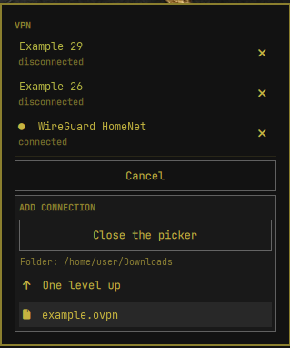
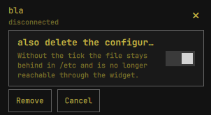

# VPN -- connections from the Omarchy bar

An Omarchy bar widget for OpenVPN and WireGuard connections. The bar button
shows a closed padlock as soon as at least one configured connection is up;
the popup lists every connection with its state, and a click toggles it.
Connections are created through the widget itself or by hand -- none ship
with the plugin.



## Installation

Five steps. Steps 3 and 4 need root and are explained in detail under
"Requirements" below -- what the two helper programs do, and why one of
them runs without a password and the other does not.

**1. Get the plugin.**

```bash
omarchy plugin add https://github.com/SmartALB/omarchy-vpn-widget --enable --yes
```

The directory is named after the plugin id from the manifest, not after
the repository: it lands in `~/.config/omarchy/plugins/smartalb.vpn/`.
`--enable` also registers the widget in `~/.config/omarchy/shell.json`
under `bar.layout.right`. Without it, or after a manual `git clone` into
`~/.config/omarchy/plugins/`, either run `omarchy plugin enable
smartalb.vpn --section right` or add the entry by hand:

```json
{ "id": "smartalb.vpn" }
```

The file is alphabetically sorted JSON with two-space indentation; if you
rewrite it with a tool, keep that.

**2. Install the packages.**

```bash
sudo pacman -S --needed jq qt6-declarative
```

`systemd-resolvconf` in addition if any WireGuard configuration carries a
`DNS =` line -- see the note at the end of "Requirements".

**3. Prepare the plugin.**

```bash
cd ~/.config/omarchy/plugins/smartalb.vpn
./install
```

This creates an empty connection list if none exists and reports what is
still missing. It changes nothing outside your own home directory.

**4. Install the two helper programs, as root.**

```bash
sudo install -m 755 -o root -g root \
  ~/.config/omarchy/plugins/smartalb.vpn/share/omarchy-vpn-privileged \
  /usr/local/bin/omarchy-vpn-privileged

printf '%s ALL=(root) NOPASSWD: %s\n' "$USER" /usr/local/bin/omarchy-vpn-privileged \
  | sudo tee /tmp/smartalb-vpn.new >/dev/null
sudo visudo -c -f /tmp/smartalb-vpn.new
sudo install -m 440 -o root -g root /tmp/smartalb-vpn.new /etc/sudoers.d/smartalb-vpn
sudo rm -f /tmp/smartalb-vpn.new
sudo visudo -c

sudo install -m 755 -o root -g root \
  ~/.config/omarchy/plugins/smartalb.vpn/share/omarchy-vpn-import \
  /usr/local/bin/omarchy-vpn-import

sudo install -m 644 -o root -g root \
  ~/.config/omarchy/plugins/smartalb.vpn/share/omarchy-vpn-import.policy \
  /usr/share/polkit-1/actions/org.omarchy.smartalbvpn.import.policy
```

The sudoers line is deliberately checked in a temporary file first
(`visudo -c -f`) and only then moved into place, not the other way round.
Write straight into the target file and check afterwards, and a typo would
cripple **every** `sudo` on the machine for the window between writing and
fixing -- you would lock yourself out.

Without the first program nothing can be switched; without the second no
connection can be created or its file removed. Rerun `./install` to see
what is still missing.

**5. Restart the shell.**

```bash
omarchy-restart-shell
```

QML changes only take effect after that -- the shell caches plugin QML.

## Updating

```bash
omarchy plugin update smartalb.vpn
omarchy-restart-shell
```

**That is not enough on its own.** The two programs under `/usr/local/bin/`
are copies, deliberately so: a `NOPASSWD` rule pointing at a file in
`~/.config/omarchy/plugins/` -- a directory you can write to -- would be a
root shell. An update therefore refreshes the sources under `share/`
while the running copies stay as they were, and nothing points that out.
After every update, check and if necessary reinstall:

```bash
cd ~/.config/omarchy/plugins/smartalb.vpn
cmp -s share/omarchy-vpn-privileged /usr/local/bin/omarchy-vpn-privileged || echo "omarchy-vpn-privileged is out of date"
cmp -s share/omarchy-vpn-import     /usr/local/bin/omarchy-vpn-import     || echo "omarchy-vpn-import is out of date"
```

Reinstall with the two `install` commands from step 4. This matters for
`omarchy-vpn-import` in particular: it decides what may be written into
`/etc`, so a fix in it only takes effect once the copy has been replaced.


## Requirements

- `jq`
- The QML module `Qt.labs.folderlistmodel` from `qt6-declarative` (it lives
  under `/usr/lib/qt6/qml/Qt/labs/folderlistmodel`). The file picker is a
  plain data model inside the panel -- **no** `xdg-desktop-portal` and
  **no** file dialog needed; see "Why the file picker sits in the panel"
  below.
- The systemd units named in `vpn-connections.json` -- created through the
  widget (see "Creating a connection" below) or by hand.
  `openvpn-client@.service` expects the configuration as `%i.conf` in
  `/etc/openvpn/client/`. Connections created through the widget satisfy
  that automatically -- `omarchy-vpn-import` writes straight to
  `<name>.conf`. If instead you register an existing `.ovpn` file by hand
  rather than importing it through the widget, you need a symlink for it:

  ```bash
  sudo ln -sfn myvpn.ovpn /etc/openvpn/client/myvpn.conf
  ```

- The helper program `omarchy-vpn-privileged`, installed into
  `/usr/local/bin/`, and a sudoers line for it -- both from step 4 of the
  installation above.

  The program takes `start` or `stop` and a unit name, checks both against
  `^(openvpn-client|wg-quick)@[A-Za-z0-9_.-]+$` and then replaces itself
  with `systemctl`. That is why the sudoers line can do without any
  restriction on the arguments -- and why a new connection needs **no**
  root intervention any more, only an entry in `vpn-connections.json`.

  **That check is only sufficient as long as the VPN configurations
  themselves are clean.** The sudoers rule switches **every** unit
  `openvpn-client@X` for which an `X.conf` exists in
  `/etc/openvpn/client/` -- and likewise every `wg-quick@X` with a matching
  `/etc/wireguard/X.conf`. The unit name alone therefore says nothing any
  more about what runs as root at start: an OpenVPN configuration can run
  arbitrary commands as root through `script-security 2` and an `up`
  script. The security of this model consequently also rests on **no**
  `.conf` in `/etc/openvpn/client/` -- and no target of a symlink from
  there, see above -- being writable by the logged-in user; the same goes
  for `/etc/wireguard/`. For configurations created through the widget,
  `omarchy-vpn-import` takes care of that (see "Why the import asks for a
  password and switching does not" below); for files created by hand it is
  the user's own business. You can check it with:

  ```bash
  ls -l /etc/openvpn/client/ /etc/wireguard/
  ```

  No entry may be writable by your own user or by one of your groups --
  not through a symlink pointing there either.

  Why not simply a regular expression in sudoers, which this version of
  `sudo` is perfectly capable of? Because a check written in code can be
  tested. The test suite proves for every rejected input that nothing is
  executed; an expression in sudoers would have nobody to check it.

  **The helper program must not stay in the plugin directory.** A
  `NOPASSWD` rule pointing at a user-writable file is a root shell.
  `~/.config/omarchy/plugins/` belongs to the user -- so the plugin ships
  only the source under `share/`, and the running copy sits `root:root`,
  `755`, under `/usr/local/bin/`.

  A plugin update does not refresh this copy -- see "Updating" above. The
  same holds for `omarchy-vpn-import`. `./install` only notices a program
  that is missing altogether, not one that is out of date.

- The helper program `omarchy-vpn-import` and the polkit action that goes
  with it, both needed to create connections through the widget or to
  remove their configuration file again -- also from step 4 above.

  Unlike `omarchy-vpn-privileged`, this program does **not** run without a
  password -- see "Why the import asks for a password and switching does
  not" further down. `./install` checks whether it is installed and warns
  when the polkit action is missing: without it the password dialog still
  works, but shows the bare program path instead of a comprehensible
  question.

There is deliberately no upfront probe that tests the passwordless `sudo`
in isolation. The obvious candidate would have been
`sudo -n systemctl start --dry-run <unit>`, but according to
`man systemctl` `--dry-run` is not provided for the verb `start`; whether
it really only simulates there or actually brings the connection up is not
reliably guaranteed -- too risky a bet on a real VPN unit for a mere
smoke test. `./install` therefore checks only what can be answered without
executing anything: whether `/usr/local/bin/omarchy-vpn-privileged` exists
and is executable. A missing permission, by contrast, shows up at the first
real switch: `omarchy-vpn-toggle` passes through the last line from `sudo`
and reports it clearly, both in the panel and through the exit code.

### WireGuard and `DNS =`

`wg-quick` calls `resolvconf` for every `DNS =` line -- unconditionally,
and it is not part of a base Arch installation. Without it the connection
fails at start with:

```
resolvconf: command not found
```

The unit then goes to `failed`, and the panel shows exactly that line. The
fix is the package:

```bash
sudo pacman -S --needed systemd-resolvconf
```

There is a second way this goes wrong, with a different message:

```
resolvconf: signature mismatch: /etc/resolv.conf
resolvconf: run `resolvconf -u` to update
```

Here `resolvconf` exists but refuses. Two packages provide the command:
`systemd-resolvconf`, which is a thin shim in front of `systemd-resolved`,
and `openresolv`, which manages `/etc/resolv.conf` itself. If `openresolv`
is installed while `/etc/resolv.conf` points at
`/run/systemd/resolve/stub-resolv.conf` -- that is, `systemd-resolved` is
actually in charge -- then `openresolv` finds a file it did not write and
declines to touch it. The interface comes up, the address and MTU are set,
and only then does the DNS step fail; `wg-quick` tears the whole thing down
again, so the unit ends in `failed` with no tunnel.

Do **not** follow the suggestion and run `resolvconf -u`: that has
`openresolv` take the file over and work against the resolver that is
actually managing it. Install the matching bridge instead --
`systemd-resolvconf` conflicts with `openresolv`, so pacman will offer the
swap:

```bash
sudo pacman -S systemd-resolvconf
```

Which of the two is installed is worth checking before blaming the
configuration:

```bash
pacman -Qo "$(command -v resolvconf)"
ls -l /etc/resolv.conf
```

A configuration that sets its resolver through `PostUp = resolvectl ...`
instead of `DNS =` avoids the dependency -- but such a hook is rejected by
the import on purpose, because `wg-quick` passes those four `PostUp`,
`PreUp`, `PostDown` and `PreDown` lines to `eval` as root. See "What gets
accepted -- and why not more". Written into `/etc/wireguard/` by hand as
root, it works.

## The connections

`~/.config/omarchy/vpn-connections.json`. `./install` creates it if it is
missing -- as an empty array. An entry looks like this:

```json
[
  { "id": "Example_29", "label": "Example 29", "unit": "openvpn-client@Example_29", "group": "provider" }
]
```

`group` makes connections mutually exclusive: start one, and every other
active connection in the same group is stopped first. Entries without a
`group` are independent and keep running alongside each other.

`./install` checks an already existing file by the same criteria as
`omarchy-vpn-list` (valid JSON, an array, every element an object) and
warns clearly, with the path and the expected format, when that does not
hold -- without changing the file, since it is the user's configuration.
Without that check all you saw was an empty popup, with no discernible
reason.

An entry created by hand rather than through the widget is an entry in this
file -- nothing else. With the helper program in place, a matching sudoers
entry per unit is not needed. The unit merely has to match
`^(openvpn-client|wg-quick)@[A-Za-z0-9_.-]+$`; anything else is refused by
`omarchy-vpn-privileged`, and `omarchy-vpn-toggle` reports the reason.

`id` has to be unique within the file. Connections created through the
widget are protected against duplicates: `omarchy-vpn-config add` -- the
step `omarchy-vpn-add` performs at the end -- refuses an `id` that is
already taken, before it is written. For an entry maintained by hand,
nothing checks: with a duplicate `id`, `omarchy-vpn-toggle` takes the first
match while `omarchy-vpn-list` still renders both rows in the panel, so a
click on the second row switches the first row's unit. That is a deliberate
decision against an extra check at this point: a hand-edited entry with a
duplicate `id` is a rare typo, not input to be expected regularly -- the
consequence is documented here instead of being caught with extra code.

### Creating a connection

In the panel, "Add connection", then "Choose a file ..." -- a file list
unfolds **inside the panel**. It shows the current folder as a header, below
it "One level up", and then the contents: subfolders first, then the files,
filtered to `*.ovpn` and `*.conf`. It starts in `~/Downloads` if that
exists, otherwise in the home directory, and remembers within a session
where you were last. A click on a folder descends into it, a click on a file
picks it. The same button then reads "Close the picker" -- that is the way
back without picking anything.

The widget then shows the chosen path and a summary (kind, remote, whether
key material is embedded) -- the *content* itself appears nowhere. After
that, type a label and press "Create"; the password dialog of
`omarchy-vpn-import` follows.

The list is bounded in height and scrolls within itself, so that a folder
with many entries does not stretch the panel apart. If a folder is empty,
holds nothing matching, or is unreadable, that is stated there as a
sentence -- "One level up" stays visible above it, so there is always a way
out again.

Two limits worth knowing:

- Folders whose **name contains a `#`** cannot be opened by
  `FolderListModel` (Qt 6.11, measured). The list then stays empty and says
  so; the way up keeps working. Files with a `#` in the name are not
  affected and can be picked normally.
- Hidden files and folders (leading dot) are not shown.

#### Why the file picker sits in the panel

It used to be a `FileDialog` from `QtQuick.Dialogs`, that is, a window of
its own. Clicking it **terminated the entire Quickshell process** -- the bar
vanished. Qt registers the dialog with `xdg-desktop-portal`; but
Quickshell's D-Bus connection already carries an application id (Omarchy's
polkit agent registers beforehand), the registration fails ("Could not
register app ID: Connection already associated with an application ID"),
and `gio` aborts while building the D-Bus message.

`Qt.labs.folderlistmodel`, by contrast, is a plain data model: no window, no
D-Bus, no portal registration. If you change anything here, leave it that
way.

The file is read as **the user**, not as root: `omarchy-vpn-add` reads it
once and passes only its content through a pipe to `omarchy-vpn-import`.
The *path* is never handed to the privileged program -- it runs as root and
could otherwise install a file the user is not even allowed to read.

If the file cannot be found, is a directory, is unreadable or is empty,
`omarchy-vpn-add` reports that with a message of its own for each case
(exit 10) -- and does so before the password dialog appears.

#### What happens to the chosen file

It is **only read**. Nothing is moved, nothing deleted, nothing renamed, and
**no reference** to it comes into being. What gets written is a
self-contained **copy** of its content:

| Kind | Target | Owner | Mode |
|---|---|---|---|
| OpenVPN | `/etc/openvpn/client/<name>.conf` | `root:root` | `600` |
| WireGuard | `/etc/wireguard/<name>.conf` | `root:root` | `600` |

`<name>` is the name derived from the label (see below). The write is atomic
-- first beside it, then renamed -- so that an aborted import leaves behind
no half configuration that `systemctl start` could pick up.

#### When the target file already exists

If a file already lies under the derived name, its **content** decides:

- **Byte-identical** to what is to be installed: the import is done without
  writing, and `omarchy-vpn-add` then creates the list entry. That is the
  way back when a connection was removed earlier without ticking "also
  delete the configuration file" (see "Removing a connection") -- picking
  the same file again is enough.
- **Differing content**: rejected with exit 72 and the message "file
  already exists with different content". It is **never** overwritten --
  not even when no list entry for the file exists any more. The same
  directories hold the configurations placed there by hand, which never had
  an entry; those are exactly the ones a "no entry, so away with it" would
  hit. The way out is in the message: either pick a different label, or
  remove the file (`sudo rm <target>`).

The comparison runs **inside the privileged program**, which is allowed to
read the file as root; nothing but the exit code reaches the outside. And it
runs **after** the allowlist: a configuration that fails the check is
rejected even when it happens to be identical to an existing file.

The source file is **dispensable** afterwards: it may be moved, renamed,
deleted, or put back onto an encrypted volume -- the connection keeps
working. Conversely, editing the source file later changes **nothing** about
the running connection; for that it would have to be imported again (first
remove the old one through the cross in the panel, with "also delete the
configuration file" ticked).

> **Not to be confused with the symlink example under "Requirements".**
> There, for manual operation, stands
> `sudo ln -sfn myvpn.ovpn /etc/openvpn/client/myvpn.conf` -- that is a
> *reference*, and with it the source file remains the actual
> configuration: it has to stay put, and whoever may write it thereby
> decides what runs as root at the next start. The route through the widget
> does expressly the opposite, and **the whole permission model rests on
> that**: because a root-owned copy lies in `/etc` and not a reference to a
> file in the user's home directory, the content is fixed after the
> one-time password dialog -- and that is why switching may be
> passwordless afterwards (see "Why the import asks for a password and
> switching does not"). Were it a symlink, the user could change the
> configuration afterwards without authenticating again.

The label becomes the name -- at once the file name, the unit instance and
the `id`. Disallowed characters become `_`, leading `-` are dropped, and for
WireGuard it ends at 15 characters (`wg-quick`'s limit for interface names),
for OpenVPN at 64. "Example 29" thus becomes `Example_29`, unit
`openvpn-client@Example_29`. If nothing usable is left afterwards -- with a
label made purely of spaces and special characters, say -- `omarchy-vpn-add`
refuses it before the password dialog even appears.

There is no fingerprint comparison any more. It was necessary as long as the
input came from the clipboard and was read twice for that -- between the
summary and the creation it could change. With a file, `omarchy-vpn-add`
reads **once** and passes the same content on to both the check and the
import; there is nothing left that could differ in between.
`bin/omarchy-vpn-inspect` still emits the `sha256` field, but the flow does
not use it: it proves in the tests that the normalization of
`omarchy-vpn-inspect` and `omarchy-vpn-import` agrees (exactly one trailing
newline).

### What gets accepted -- and why not more

For OpenVPN an **allowlist** applies: what is permitted is enumerated, not
what would be forbidden. A configuration is rejected as soon as it contains
a directive that is not on it -- with the line number and the directive.

The list holds 112 directives: everything a **self-contained client
configuration** needs -- remote, protocol, device, encryption and
negotiation, certificate checking, timing and retry behavior, verbosity,
routing, dropping privileges (`user`, `group`). What is **not** on the list
is **anything that reads or writes a file, starts a program, opens a control
channel, or switches to server mode**.

Embedded blocks are skipped, but **not all of them**: only the twelve that
carry key material (`<ca>`, `<cert>`, `<key>`, `<dh>`, `<extra-certs>`,
`<pkcs12>`, `<crl-verify>`, `<tls-auth>`, `<tls-crypt>`, `<tls-crypt-v2>`,
`<peer-fingerprint>`, `<verify-hash>`). OpenVPN can inline more than keys --
`<auth-user-pass>`, for instance, carries a user name and password in the
clear, `<auth-gen-token-secret>` a key. Every other block is judged like a
directive and therefore falls foul of the allowlist.

Markers are read exactly as OpenVPN reads them -- **strip the indentation
first, then compare**. A closing marker indented with a tab (`	</ca>`)
closes the block for OpenVPN; if it did not do so for the check, everything
following would be silently skipped. An opening marker only counts in the
shape OpenVPN accepts: exactly `<tag>`, with nothing trailing.

There is a reason for the switch: the earlier blocklist failed three times
at the same spot. OpenVPN 2.7.6 knows 297 directives, and a blocklist only
protects against what somebody has read up on beforehand -- the most recent
omissions were `http-proxy-user-pass <file>` (OpenVPN reads the file as root
and sends the beginning of it to the proxy), `dev-node unix:<program>`
("OpenVPN will start the program", entirely without `script-security`), and
`setenv opt <x>`, which puts a prefix in front of any directive at all and
thereby carries it past every blocklist.

The gaps that remained after that no longer sat at the names but ahead of
them -- **in the parsing of the line**, that is, in what OpenVPN does
*before* it compares: indented block markers, trailing text on a marker,
credentials written inline. The rule that follows from this, and that the
check obeys everywhere today: **our ordering has to match OpenVPN's.**

That costs something, and it is meant to: **harmless configurations are
rejected along with the rest.** Anyone who needs `daemon`, `user` or a proxy
directive will not get through the widget. The answer to that is not a
loosening but the way around it -- the file can still be placed into
`/etc/openvpn/client/` by hand. The error message names that route.

In return, the check is stable against new OpenVPN releases: a newly added
directive is not on the list and is rejected -- too strict in case of
doubt, never too lax.

Expressly rejected as well are `auth-user-pass`, `askpass` and
`static-challenge`: credentials are not supported, and a systemd unit has
nobody it could ask for a password.

For **WireGuard** it stays a **blocklist** -- `PostUp`, `PreUp`,
`PostDown`, `PreDown`. The reason is verifiably different: in the
`[Interface]` section `wg-quick` knows exactly nine keys (`Address`, `MTU`,
`DNS`, `Table`, `SaveConfig` and the four hooks), and passes everything else
on to `wg setconf` unchanged. And `wg-quick` contains exactly **one** `eval`
-- in `execute_hooks`, fed exclusively from those four. Where a blocklist
covers its class completely, it is the milder means.

Two programs check this: `bin/omarchy-vpn-inspect` for the display in the
panel, and `share/omarchy-vpn-import` authoritatively, immediately before it
writes -- a privileged program does not trust its caller. Both rule sets
therefore stand twice in the code; an agreement test in `test/run-tests.sh`
holds them together.

This check is the **second** line, not the first -- the first is the
password dialog itself. It protects against the mishap: the foreign `.ovpn`
from the net that hooks in a script on the side, or the template whose `up`
line you overlook while copying. It does **not** protect against the user
himself -- anyone who deliberately places a root-executing directive into
`/etc/openvpn/client/` or `/etc/wireguard/` around the check needed root for
that anyway.

### Why the import asks for a password and switching does not

An `.ovpn` file may execute arbitrary code as root through
`script-security 2` and `up <script>` as soon as the corresponding unit is
started. Whoever may write a configuration into `/etc` thereby decides
indirectly what runs as root later -- installing is rare and far-reaching.
Switching, by contrast, is frequent and harmless: starting or stopping an
already installed, already checked configuration changes nothing about what
it does. Hence two programs with two privilege levels:
`omarchy-vpn-privileged` runs without a password through a sudoers rule on
exactly one program, which checks its arguments itself (see "Requirements"
above); `omarchy-vpn-import` demands authentication through polkit on every
call.

### Removing a connection



Through the cross next to an entry in the panel, in two stages. Without
ticking "also delete the file", only the entry disappears from
`vpn-connections.json` -- no consequences, no password dialog, the file in
`/etc` stays behind. With the tick, the password dialog of
`omarchy-vpn-import` comes on top and the file is removed as well. The
default is the tick **off** -- removing without the file is the more
harmless half-state should something fail in between.

What the tick costs when you do *not* set it therefore stands next to it in
the panel: **the file stays behind in `/etc` and is afterwards no longer
reachable through the widget.** `omarchy-vpn-forget` needs `<id>` and
`<unit>` from the list to know what to delete -- without a list entry there
is no cross left to click. The way back leads through the import -- pick the
same file once more: it accepts a byte-identical existing file without
writing, and the list entry comes into being again (see "When the target
file already exists"). Only somebody who now wants to install a *different*
file under the same name has to remove the old one by hand.

## How it fits together

```
Panel.qml
  |- bin/omarchy-vpn-list --json      -> systemctl is-active (no root)
  |- bin/omarchy-vpn-toggle <id>      -> sudo -n omarchy-vpn-privileged <action> <unit>
  |- file list (FolderListModel, in the panel)
  |     `- cat <file> | bin/omarchy-vpn-inspect      -> summary (no root)
  |- bin/omarchy-vpn-add <path> <label> ...  -> reads the file as the user, then
  |     |- pkexec omarchy-vpn-import add     -> password dialog, content over stdin,
  |     |                                       writes /etc
  |     `- bin/omarchy-vpn-config add        -> vpn-connections.json (no root)
  `- bin/omarchy-vpn-forget <id> <unit>      -> entry first, then (optionally) the file
```

The state is readable without any privileges; only switching and installing
need them -- the former without a password through `sudo -n`, the latter
with a password dialog through `pkexec`.

`omarchy-vpn-list --json` emits a JSON object with `error` on stdout on
every error path -- for usage errors (a wrong call) and for a missing `jq`
as well. That way the panel never has to guess at empty or unexpectedly
shaped output. The message for the case "`jq` is missing" is deliberately
built with `printf` rather than with `jq` itself -- otherwise the error path
that reports precisely the absence of `jq` would need `jq`.

An unknown connection exists only for `omarchy-vpn-toggle <id>`, not for
`list` -- `list` knows no single `id`, it always emits all configured
connections. `toggle` reports an unknown `id` as plain text on stderr
(exit 2), not as JSON -- the panel already collects stderr separately for
exactly this case.

### When nothing switches at all

The panel shows the connections, but a click brings no tunnel up and the
message mentions `sudo` or a password. Two different causes look the same
from the outside, and both are about the setup, not the connection:

- **The helper program is not installed.** `/usr/local/bin/omarchy-vpn-privileged`
  is missing -- the `sudo install` from step 4 was skipped, or an update
  refreshed only `share/` (see "Updating").
- **The sudoers line is missing or does not match**, for instance because
  it names a different path or a different user.

They are hard to tell apart from the message, because a rule whose program
`sudo` cannot resolve does not count as matching either -- so a missing
program can present itself as a missing permission. What separates them
reliably:

```bash
cd ~/.config/omarchy/plugins/smartalb.vpn
./install          # says so when a helper program is missing
sudo -l | grep omarchy-vpn    # shows whether the rule exists
```

`./install` executes nothing privileged and changes nothing outside your
own home directory, so it can be run at any time as a check.

If both are in place and switching still fails, the cause is no longer the
setup but the unit -- carry on with the next section and with
`journalctl -u <unit>`.

### `RTNETLINK answers: File exists`

Two tunnels into the same network collide over the route. The second
`wg-quick` gets as far as the route and then aborts; it tears its own
interface down again, so the unit ends in `failed` and no tunnel is left:

```
[#] ip -4 route add 10.42.0.0/23 dev <name>
RTNETLINK answers: File exists
[#] ip link delete dev <name>
```

`group` is there for exactly this, and it settles the case among the
connections in the list: starting one stops the others in its group first.
What it cannot see is a unit that is **not** in the list. Such a unit is
easy to end up with:

- a connection that used to be in the list under a different name and was
  started once -- the tunnel keeps running,
- a tunnel that was already up before the plugin was installed or
  reinstalled. Removing the plugin does not stop anything; `uninstall`
  says as much.

The list then shows one connection in `failed` while another, invisible to
it, holds the route. What is actually running:

```bash
ip route show 10.42.0.0/23
ip -brief link show type wireguard
systemctl list-units 'wg-quick@*' --all
```

Stop the leftover unit with `sudo systemctl stop wg-quick@<name>`, and if
its configuration in `/etc/wireguard/` is not needed any more, remove that
too -- otherwise the name will get in the way the next time a connection is
created.

### When the displayed state is wrong

`omarchy-vpn-list` reads nothing but `systemctl is-active` -- what happens
outside systemd it does not see. Two cases are known and are not faults of
the widget:

- A WireGuard unit (`wg-quick@<name>`) is `Type=oneshot` with
  `RemainAfterExit=yes`: systemd remembers "started" without keeping the
  process running. If the interface is removed by some other route -- by
  hand with `wg-quick down <name>`, or by another tool -- the unit stays
  `active` all the same. The panel then still shows "connected" even though
  the tunnel is gone. A click on it makes `ExecStop` fail and the unit go to
  `failed`; a second click (a restart through the start path) restores the
  correct state.
- If a connection is started outside systemd -- manually with
  `openvpn --config ...` or `wg-quick up <name>` for testing, say -- the
  behavior differs by kind. With **OpenVPN** the corresponding unit stays
  `inactive` as far as systemd is concerned even though a tunnel is
  running: a click in the panel then starts a **second**, parallel tunnel
  instead of toggling. With **WireGuard** the start through the widget
  fails instead: `wg-quick up <name>` aborts because the interface already
  exists, and the unit goes to `failed`. In both cases a look at
  `journalctl -u openvpn-client@<name>` or
  `journalctl -u wg-quick@<name>` helps identify the cause; to bring down a
  tunnel started this way, only the route it was started through helps --
  not the widget.

## Starting at boot

```bash
sudo systemctl enable wg-quick@<name>
```

Not part of the widget, but the obvious next step.

## One risk

Switch off the connection your own session currently runs over and you cut
your own line. Whether that matters depends on your setup -- if access runs
over a second, independent route (Tailscale, say), you stay reachable; if
the VPN tunnel itself leads to the machine, the session is gone.

## Tests

```bash
./test/run-tests.sh
```

181 tests, all green. The tests run with an **exclusive** `PATH` made of a
stub directory and a symlink farm of the tools needed. A `systemctl` stub
keeps states in files and logs every call, so that the ordering can be
checked too -- that the group partner really is stopped *before* the start,
for instance. `pkexec` is stubbed as well: it logs the call and executes it
-- or aborts with 126 when a test simulates that. The input files for
`omarchy-vpn-add` are created by the tests as real files in the sandbox and
passed by path; there is no clipboard stub any more. `OMARCHY_VPN_POLICY`
too points at a sandbox file during the tests rather than at the real
polkit action under `/usr/share/polkit-1/actions/`. No test calls the real
`systemctl` or the real `pkexec`, and none depends on the state of the test
machine outside the sandbox.

The allowlist is checked **in both directions** and **over the full base
set**: all 297 directives of the OpenVPN 2.7.6 manual page stand in two
tables -- the 111 of them that are listed have to be accepted, the
remaining 186 rejected. One listed directive, `ncp-ciphers`, is no longer a
manual heading in 2.7.6 and therefore appears in neither table; it stands
additionally in the table of listed directives, which thereby counts 112
entries instead of 111. Put a directive on the list or take one off it, and
exactly one test turns red and names it. On top of that there is a table of
every directive that four reviews of this project found to be an attack
path -- every single one passes OpenVPN 2.7.6's option check, every single
one has to be rejected. In the other direction: a stock of nine invented but
realistically built provider configurations (two commercial services, a
company gateway, `.ovpn` exports from pfSense and OPNsense, an old style
with `comp-lzo`, a new one with `data-ciphers`, one with several
`<connection>` blocks) -- none of them may be refused. Without that second
direction, an **empty** list would pass every attack probe too. All nine
were held against the installed `openvpn` and accepted by it; the test
versions carry placeholders instead of key material.

Both privileged helper programs run as copies in the tests: for
`omarchy-vpn-privileged` the hard-wired line
`SYSTEMCTL=/usr/bin/systemctl` is textually bent to the stub, and for
`omarchy-vpn-import` the target directories (`OPENVPN_DIR`,
`WIREGUARD_DIR`) point into the sandbox instead of at `/etc`. Both
originals deliberately read nothing from the environment, because they run
as root. The sandbox aborts if either of those substitutions fails to take
effect.
