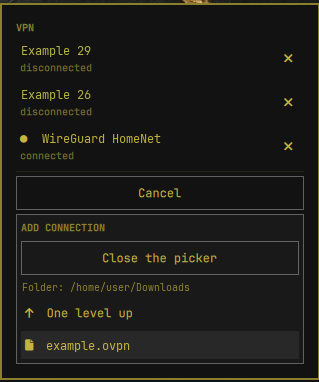

# VPN Units

Version 2.0.0 changes the authorization model; existing installations require
the explicit system migration below before switching connections again.

An Omarchy Quickshell bar plugin for OpenVPN and WireGuard systemd units.
Click a connection to start or stop it. Connections sharing a nonempty group
are switched together: stop running peers, then start the selected connection.



## Authentication and scope

**Starting, stopping, switching groups, importing and deleting configuration
files require administrator authentication through Polkit.** Both policies use
`auth_admin`, never `auth_admin_keep`. Local administrator policy can override
these defaults. The plugin installs no passwordless sudoers grant.

One click issues one `pkexec` request. A group switch, including all necessary
stops and the subsequent start, is one authorized operation. Cancelling the
authentication dialog makes no service changes. A failed peer stop prevents
the target start; already stopped peers are not automatically restarted.

Viewing status needs no authentication. The display describes **systemd unit
state**, not verified tunnel reachability, WireGuard handshake or IP-leak
protection. This is not a kill switch or a NetworkManager frontend.

OpenVPN configurations must use certificates/keys. `auth-user-pass` is not
supported; many commercial-provider profiles therefore cannot be imported.
WireGuard authenticates with keys. Import and subsequent connection are separate
actions and each requests its own authorization.

## Requirements

- Omarchy with the Quickshell plugin API and a working graphical Polkit agent.
- Bash, jq, systemd, coreutils (`timeout`), util-linux (`flock`), Polkit (`pkexec`).
- OpenVPN and/or wireguard-tools for the corresponding unit templates.
- `systemd-resolvconf` for WireGuard profiles using `DNS =`.
- Python 3 and Qt 6 QML tools for tests only.

The plugin does not install dependencies automatically. System services and
other applications may depend on VPN units; check that before disconnecting.

## Install and migrate

Review the source first. Plugins run unsandboxed as your user. System setup
explicitly authorizes installation of root-owned code from the reviewed checkout;
the payload fingerprints verify transfer consistency, **not independent provenance**.

```sh
omarchy plugin add https://github.com/SmartALB/omarchy-vpn-widget
```

In the installed plugin directory, as your normal user:

```sh
./install
./install --system
omarchy plugin enable smartalb.vpn
```

The first command prepares user files and checks dependencies; it does not
elevate. Existing connection lists are not overwritten. `--system` explicitly
requests administrative privileges and installs:

| File | Purpose |
|---|---|
| `/usr/local/bin/omarchy-vpn-switch` | Authenticated unit control; source is `share/omarchy-vpn-privileged` |
| `/usr/local/bin/omarchy-vpn-import` | Authenticated import/removal |
| `/usr/share/polkit-1/actions/org.omarchy.smartalbvpn.switch.policy` | Switch authorization |
| `/usr/share/polkit-1/actions/org.omarchy.smartalbvpn.import.policy` | Import authorization |

Helpers are root-owned mode 0755; policies are root-owned mode 0644. Updating
the plugin checkout alone does **not** update installed system copies. Review
changes and run `./install --system` again when helpers/policies change.

### Migration from the passwordless version

The new switching helper deliberately uses a **different installed path**.
There is no fallback to the old passwordless helper. Before system migration,
the new panel reports that the new helper is missing rather than silently
using the old authorization path.

`./install --system` checks `/etc/sudoers.d/smartalb-vpn`. If it contains exactly
the historical single rule for the current numeric UID or login name and the
old helper path, that grant is revoked **before** publishing the new helpers.
An extended/custom rule, symlink or other unexpected file causes a refusal;
review it manually rather than deleting someone else's policy. No sudoers rule
is created. If a later publication fails, the passwordless grant stays revoked;
repair the reported problem and repeat system installation.

Publication failures and catchable termination signals trigger rollback of
changed helper/policy files. Rollback errors are reported and root-side staging
backups retained. No rollback can be guaranteed after SIGKILL or power loss.

The old `/usr/local/bin/omarchy-vpn-privileged` file is left in place without
the plugin's sudoers grant, rather than deleting a potentially independently
modified file. Administrator-created grants elsewhere are outside this migration
and must be reviewed separately. No VPN service is started/stopped by installation.

## Connections

The connection list is `~/.config/omarchy/vpn-connections.json`:

```json
[
  {"id":"office","label":"Office","unit":"openvpn-client@office","group":"work"},
  {"id":"lab","label":"Lab","unit":"wg-quick@lab","group":"work"}
]
```

Units must use `openvpn-client@<name>` or `wg-quick@<name>`; an optional
`.service` suffix is accepted. The root helper validates every unit and the
complete request before changing anything. An authorized caller can control
matching VPN units, not only those in the displayed list. Group membership
comes from the user's list and is not a system-wide security policy.

Click **Add connection**, select a local `.ovpn`/`.conf` file, inspect the
preview and confirm. The import helper independently validates bounded input,
rejects unsupported/executable directives and publishes root-owned mode 0600
files under `/etc/openvpn/client/` or `/etc/wireguard/`. Private file contents
are piped to the importer, not placed in process arguments. Unrestricted
OpenVPN `setenv` and executable hooks are rejected; `setenv-safe` is allowed.

Names/labels/groups are user metadata, not credentials. Removing a list entry
does not delete the VPN configuration unless file deletion is explicitly
selected and authorized. Configurations installed manually, including their
referenced keys/files and unit overrides, remain the administrator's responsibility.

## Limits and errors

- The complete root-side switch has a 90-second execution budget **after**
  authorization. The panel additionally has a 120-second overall request limit,
  including the authentication dialog, and caps collected output.
- Concurrent switch operations are refused using a root-side lock.
- A timeout does not cancel a systemd job already submitted; check unit state.
- Unknown/unreadable service status prevents group switching rather than being
  treated as disconnected. The regular status display retains its simple
  active/failed/inactive representation.
- At most 200 units participate in a group request. Imported configuration
  contents and connection-state input are bounded.

## Remove

As your normal user, from the plugin directory:

```sh
./uninstall --system
omarchy plugin remove smartalb.vpn
```

System removal revokes an exactly recognized legacy grant, removes both Polkit
policies and the two current helpers. Custom legacy rules cause a refusal.
Without `--system`, uninstall only explains what remains. The connection list,
VPN configurations, and running tunnels are untouched. Remove unwanted VPN
files explicitly through the plugin before uninstalling if needed.

## Tests and development

Never run tests as root. Tests must replace privileged commands and redirect
all target paths to temporary directories. They do not establish actual Polkit
agent behavior or root ownership; test those separately in a disposable VM.

```sh
bash test/polkit-tests.sh
bash test/run-tests.sh
```

`test/run-tests.sh` additionally covers import validation, bounded input,
group handling, configuration operations and legacy-grant migration.

No real VPN credentials are needed for tests. License: MIT (see `LICENSE`).
